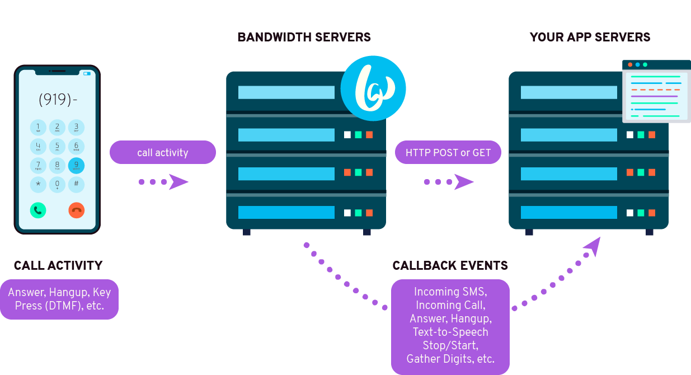

# Bandwidth Callbacks

## Bandwidth Callbacks Overview

Bandwidth's APIs operate on a system of callbacks. Most API requests send callbacks, and notices of incoming events (phone call, text message) are sent via callbacks as well.

