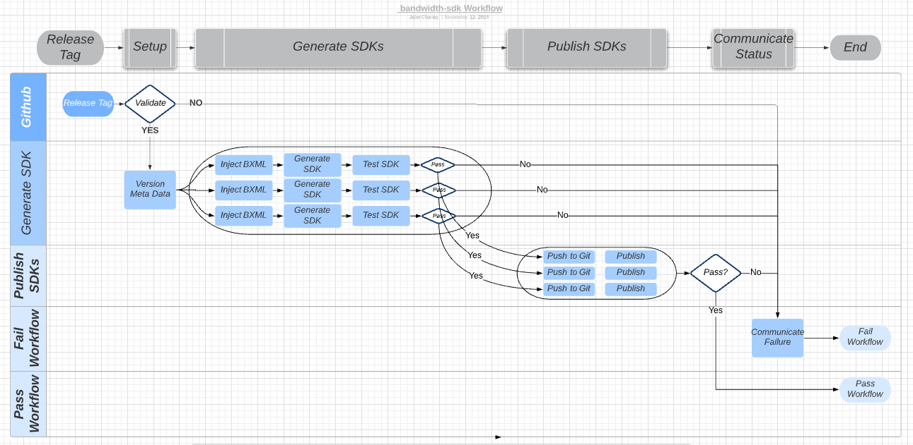

# bandwidth-sdks

This repo is for the purpose of product SDK & developer documentation generation and publication.

## Onboarding

Ideally teams will use this pipeline through devx-utils. However, devx-utils operates on the premise of an already existing OpenAPI spec. This means new teams need to seed this repo with their first version of their OpenAPI spec.

To do this, simply open a pull request against master with a new directory underneath `/specs` that contains a file called `openapispec.json`. The directory name needs to match the "title" value of the OpenAPI spec. As an example, `specs/Voice/openapispec.json` has `"title" : "Voice"`. Please have your directory name and title only be alphabetical characters (so no spaces, numbers, dashes, etc). Note that this also means your openapi spec needs to be in JSON, YAML will not work with devx-utils.

Once the PR is approved and merged, make a new release for each language (python, ruby, csharp, java, and php (soon to include node)) with a minor version increase. After this is done, devx-utils will operate as expected.

## APIMatic Automation Pipeline

It maintains the most recent OpenAPI specification files for the Messageing & Voice API endpoints.

Using these OpenAPI specifiacations it uses a third party vender, APIMatic, to generate the SDK source files and developer documentation.
These artifacts are maintained in Bandwidth's Artifactory and published to their respective package manager.

## SDK Supported Languages 

* Java
* [Python](https://dev.bandwidth.com/sdks/python.html)
* [Ruby](https://dev.bandwidth.com/sdks/ruby.html)
* PHP
* [C#](https://dev.bandwidth.com/sdks/csharp.html)
* Node.js

## How It Works

### Image Flow



### Tags

Tags are used to start GitHub Action Workflows.  The tag must start with the prefix followed byt a Semantic Versioning, example:  `java1.0.2`.  The table below are the available tag prefixes and their purposes.

| Tag    | Description                                                                                           |
|--------|-------------------------------------------------------------------------------------------------------|
| java   | Releases the Java SDK to Maven                                                                        |
| csharp | Releases the C# SDK to Nuget                                                                          |
| php    | Releases the php SDK to Packagist                                                                     |
| node   | Releases the Node SDK to NPM                                                                          |
| python | Releases the Python SDK to PyPi                                                                       |
| ruby   | Releases the Ruby SDK to RubyGems                                                                     |
| gen    | Does NOT release any SDK but does generate all SDKs and archives them to the Github Actions artifacts |

### NodeJS Scripts

Outside of Github Actions, most of the executed code resides in NodeJS scripts in the `src/` directory. These scripts are ran via `npm run <script>`. The parameters and resulting executable for these commands are found in `package.json` under `scripts`. For example, `npm run validate` would turn into `node ./src/validate.js`.

### Github Actions Pipeline

The Github Actions pipeline is divided into the following steps
* Setup
* Spec Validation
* Language Specific Steps (ran in parallel for each language)
  * Zip Custom Code
  * Update Metafiles
  * Generate SDK
  * Push SDK
  * Publish SDK

#### Setup Step

This step sets up the environment for the pipeline. Currently all it needs to do is install the npm dependencies and set up the `ERROR_FILE` for the pipeline.

#### Spec Validation Step

This step validates the OpenAPI specs against APIMatic's API. The `APIMATIC_USER` and `APIMATIC_PASS` environment variables are used by `validate.js` as the credentials for APIMatic's API. If the response from APIMatic is a 200 OK, then the pipeline continues. Otherwise, the spec is reported as invalid and the build stops.

#### Zip Custom Code

For each value in the field `customCode` in `config/languages/<language>/config.json`, the code underneath `codeRoot` is zipped into a zip file defined in `path`.

#### Update Metafiles

APIMatic's API expects 2 config files for each language. These files are defined as `config/languages/<language>/apimaticMetaConfig.json` and `config/languages/<language>/packageInformation.json'. This step updates these files as needed

#### Generate SDK

This step uses the OpenAPI specs and config files to generate a namespaced SDK using APIMatic's API. If needed, updates are made for files as needed (for example, Java's `pom.xml` needs additional values for the maven deploy).

#### Push SDK

This step uses the DX Github bot to unzip the generated SDK and pushes it to the repo that holds the SDK.

#### Publish SDK

This step publishes the generated SDK to its respective package manager. Note that PHP does not have this step (the publish to packagist is simply pushing to the Github repo, and the packagist webhook takes care of the rest).

### APIMatic V1 vs V2 SDK Generation

The genearation of SDKs can be configured to use either the V2 or V1 APIMatic API generation endpoint.  

This can be configured by setting the language specific configuration `config.json` to include the `v1OverRide` object.  
The `v1OverRide` object sets the API spec namespace to use for V1, the APIMatic template id, and a boolean for explicit use of V1. 

Example Configuration:

```
{
    "namespace": "java",
    "versionDiff": "2.0.0",
    "versionSuffix": "alpha-1",
    "apimaticTemplateId": "JAVA_ECLIPSE_JRE_LIB",
    "apimaticMetaConfig" : "apimaticMetaConfig.json",
    "v1OverRide" : {"useV1" : true, "v1Namespace" : "messaging", "apimaticTemplateId": "java_eclipse_jre_lib"}
}
```

## Language Specifics

### Python

#### Deploy Code

Pypi (https://pypi.org/) is the primary package manager for Python. `wheel` is used to package the Python code, and `twine` is used to deploy it to Pypi. These steps are performed in the directory containing the unzipped SDK

```
python -m venv venv
venv/bin/pip3 install twine
venv/bin/pip3 install wheel
venv/bin/python3 setup.py sdist bdist_wheel
twine upload dist/* -u ${PIP_USERNAME} -p ${PIP_PASSWORD}
```

Due to the Jenkins environment, these commands need to be run in `venv`.

`setup.py` is the Python file that defines how the package is to be built, and `dist/` is the directory generated by the command `python setup.py sdist bdist_wheel`.

The Python docker image contains the `venv` command to setup the Python environment to perform this build.

### Ruby

#### Deploy Code

Rubygems (https://rubygems.org/) is the primary package manager for Ruby. `gem build` is used to package the Ruby code, and `gem push` is used to deploy it to Rubygems. These steps are performed in the directory containing the unzipped SDK

```
gem build *.gemspec
gem push *.gem
```

`*.gemspec` is the Ruby gemspec file that defines how the package is to be built, and `*.gem` is the gemfile generated by the command `gem build *.gemspec`.

The Ruby docker image contains the `gem` command to perform this build. The environmental variable `GEM_HOST_API_KEY` needs to be set to authenticate the push.

### Csharp

#### Deploy Code

Nuget (https://www.nuget.org/) is the primary package manager for Csharp. `dotnet build` and `dotnet pack` are used to package the Csharp code, and `dotnet nuget push` is used to deploy it to Nuget. These steps are performed in the directory containing the unzipped SDK

```
dotnet build --configuration Release
dotnet pack
dotnet nuget push <path/to/generated/*.nupkg> -s nuget.org -k $DOTNET_TOKEN
```

The Csharp docker image contains the `dotnet` command to perform this build.

### PHP

#### Deploy Code

Packagist (https://packagist.org/) is the primary package manager for PHP. Unlike most other package managers, Packagist does not operate on the "build -> push" model. Instead, Packagist expects a public git repo containing the PHP code, and have this repo configured with a webhook that notifies Packagist of any changes (pushes to master).

Because of this, PHP has no deploy step in the Github Actions pipeline. The push step is sufficient for PHP.

## Local Installation And Testing

Simply clone the repo `git clone git@github.com:Bandwidth/bandwidth-sdks.git` to get started

To test the nodejs scripts locally, run

```
npm install
npm run test
```

## Possible Failures

The main reason for build failures is a bad OpenAPI spec. Although this pipeline validates OpenAPI specs, it is highly recommended to validate your own spec before running this pipeline for performance purposes. Swagger CLI (https://www.npmjs.com/package/swagger-cli) is a great tool for validating OpenAPI specs locally.

Another reason for build failures can result from APIMatic outages, especially from their V2 generator which as of this date (September 23rd, 2019) is still in alpha/beta.

## Future Improvements

Below is a list of considerations for improvements on the pipeline

* Use 1 docker image that satisfies all of our needs
* Be more resistent to APIMatic outages
