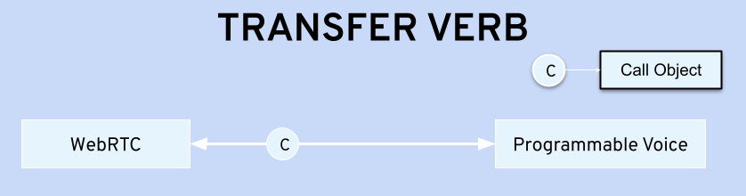

## Connecting WebRTC to Programmable Voice

Bandwidth has a demonstrated history of excellence in IP voice technologies, including comprehensive CPaaS [Programmable Voice](../../voice) (PV) and Messaging capabilities. Combining WebRTC with our Programmable Voice (PV) offering yields a rich and flexible platform that allows our customers to extend their business with a broad range of browser-based communication capabilities.

One of the steps we have taken to enable this capability suite is to ensure that our PV and WebRTC APIs combine their respective strengths when integrated.

When PV calls interwork with WebRTC communications, the behavior of the resulting call can be augmented by the extensive suite of PV capabilities. This enables your application to create voice calls, receive voice calls, insert services like recording, and control and monitor changes made to these calls. This is done with the use of "BXML" verbs supported by the PV platform.

By combining our WebRTC and programmable voice APIs, you can create composite call flows that meet your needs.

To create a Programmable Voice call that involves WebRTC endpoints, your application first establishes a connection from the Programmable Voice network to the WebRTC platform.


To interconnect a WebRTC participant to the PV network capabilities, your application first creates a WebRTC Participant to host the interconnection. The Participant security token is handed to the PV platform which sends a pre-authenticated SIP INVITE to the WebRTC service. This INVITE includes a UUI header containing the Participant authentication token which enables the system to securely identify and interconnect the PV voice capabilities and the WebRTC participants.

Once an answer is received on this SIP transaction, an interconnection is established between WebRTC and Voice.

You are able to select different overall call behaviors by choosing the BXML verbs that are used in setting up the interconnection. The three call control verbs that can be used are: Transfer, Bridge, and Conference, each of which creates a different voice application experience.

<!-- prettier-ignore-start -->
| Programmable Voice Verb | Solution Characteristics summary |
| --- | --- |
| Transfer | The simplest application behavior, with limited opportunity to invoke services on the PV call leg. Use this for simple single-party call setup if features and asynchronous / parallel behaviors are not required |
| Bridge | Suitable for single-leg interconnection where features might be required for the PV call leg. Slightly higher complexity is required in the application, but Programmable Voice features are well supported, and low call setup latencies can be achieved by asynchronous call leg setup.  Recommended for high volume / low latency applications. |
| Conference | Enables multiple participants on the PV side of the interconnection, and a full range of PV features and capabilities to be applied on the PV call leg. Additional costs are incurred for the use of the voice conference bridge. |
<!-- prettier-ignore-end -->

These three interaction models are described in greater detail below.

## Transfer

The transfer verb creates a single PV call with two endpoints. Your application sets one end of the PV call as WebRTC, and the other as the Voice Phone.



Use of the Transfer BXML Verb creates a single call that will typically be taken down from end to end when one end hangs up (or times out waiting for an answer). The call ends if the person you are transferring to does not respond. Also, any modifications to the call will take down the connection between WebRTC and the Voice Network.

In general, the Transfer verb is used in inbound or outbound WebRTC/Voice calls to create each call from scratch when the call happens. Here’s a [general example](https://github.com/Bandwidth-Samples/webrtc-hello-world-ts) of how you can use the Transfer verb:

Bandwidth's Voice API will hit a provisioned callback endpoint when you receive an incoming call

```js
    app.post("/incomingCall", async (req, res) => { const callId = req.body.callId;
        console.log(`received incoming call ${callId} from ${req.body.from}`);
        const participant = await createParticipant("hello-world-ts-phone");
        calls.set(callId, participant);
```

This generates the response payload containing the Transfer verb that is sent back to the PV API to transfer the call into the WebRTC session

```js
const bxml = WebRtcController.generateTransferBxml(participant.token, callId);
```

This sends the payload back to the Programmable Voice API

```js
    res.contentType("application/xml").send(bxml);
    console.log(`transferring call ${callId} to session ${sessionId} as participant
            ${participant.id}`);
    });
```

For an outbound call, Bandwidth's Voice API will hit a callback endpoint when an outgoing call is answered

```js
    app.post("/callAnswered", async (req, res) => { const callId = req.body.callId;
        console.log(`received answered callback for call ${callId} tp ${req.body.to}`);
        const participant = calls.get(callId);
        if (!participant) {
            console.log(`no participant found for ${callId}!`);
            res.status(400).send();
        return; }
```

When an outbound call is answered, the response payload contains the Transfer verb that is returned to the Voice API to transfer the call into the WebRTC session

```js
const bxml = `&lt;?xml version="1.0" encoding="UTF-8" ?>&lt;Response>
          &lt;SpeakSentence voice="julie">Thank you. Connecting you to your conference now.&lt;/SpeakSentence>
          ${WebRtcController.generateTransferBxmlVerb(participant.token, callId)}
        &lt;/Response>`;
```

This sends the payload back to the Voice API

```js
    res.contentType("application/xml").send(bxml);
    console.log(`transferring call ${callId} to session ${sessionId} as participant
            ${participant.id}`);
    });
```

There’s a limitation to what can be done with Transfer: the fact that only a single call recognized by the PV platform means that changes to that call will impact the WebRTC interconnection. Once the transfer is complete, you can redirect the call to another destination, however this will result in the removal of the WebRTC leg of the call.

The above example can be found in [Hello-world repository](https://github.com/Bandwidth-Samples/webrtc-hello-world-ts).

## Bridge

Use of the Bridge verb allows creation of two independent PV calls that are Bridged together. One PV call is used to connect to the phone, and the other is used to connect to WebRTC. After these calls are created they can be Bridged together. You can modify each call without breaking down the entire end-to-end communication between the webrtc and voice network sides of the communication.

This model allows your application to maintain the connection between WebRTC and Programmable Voice after the call representing the voice network phone is taken down. Various modifications can be made while the bridge exists, unlike the Transfer verb.


Here’s [an example](https://github.com/Bandwidth-Samples/webrtc-voicebridge-ts) of how you can use the Bridge Verb:

Bandwidth's Voice API calls the WebRTC infrastructure with the participant token in the UUI SIP header to allow the correlation ofV2 voice and the WebRTC infrastructure

```js
    const callSipUri = async (participant: ParticipantInfo) => {
        const body = {
            from: voiceApplicationPhoneNumber,
            to: "sip:sipx.webrtc.bandwidth.com:5060",
            answerUrl: `${voiceCallbackUrl}/bridgeCallAnswered`,
            uui: `${participant.token};encoding=jwt`,
```

This [/bridgeCallAnswered](<https://github.com/Bandwidth-Samples/webrtc-voicebridge-ts/blob/main/src/server.ts#:~:text=*/-,app.post(%22/bridgeCallAnswered%22%2C%20async%20(req%2C%20res)%20%3D%3E%20%7B,%7D)%3B,-/**>) API call links your WebRTC session with Programmable Voice. Then, Bandwidth's Voice API will hit the [/callAnswered](<https://github.com/Bandwidth-Samples/webrtc-voicebridge-ts/blob/main/src/server.ts#:~:text=app.post(%22/callAnswered,%7D)%3B>) endpoint when the separate outgoing call is answered. The two independent calls can be established synchronously or in parallel, providing the flexibility in management of the endpoints. For example, a single WebRTC-side call can be established that connects to a series of PV-side calls, without the need to set up the entire end-end experience for each new voice caller. You can find the complete code and instructions for the sample above in the [bridge repository](https://github.com/Bandwidth-Samples/webrtc-voicebridge-ts).

If reducing delays in interconnection of voice and WebRTC legs is important, the best option would be to use the bridge verb, which allows setting up the legs in parallel, or establishing one leg early in anticipation of the end to end call. Also, use of the Bridge verb is recommended if PV capabilities and services are needed on the voice phone side of the interconnection.

## Conference

Although use of the Conference verb has higher costs than the previous methods, it would be the most sustainable option for dealing with a large group of voice callers. If you expect more than two voice callers in one session, the Conference method is effective if Programmable Voice services are needed for those callers. You can have 20 calls in a conference and keep the session for 24 hours. You also have the freedom to add and remove participants from the conference.


Conferencing is actively supported by both the WebRTC and Voice platforms, however, if both platforms are interconnected, and the power of PV is needed on the voice-only call legs, use of the Conference BXML verb is valuable. If fine-grained control over media in a conference scenario is needed, or if video is required in the conference, it is likely wise to use the conferencing capability inherent in the WebRTC platform and APIs.

Here’s a [code snippet](https://github.com/Bandwidth-Samples/webrtc-voiceconf-ts) of how the Conference verb is used:

Bandwidth's Voice API calls the WebRTC SIP interconnect with the participant token in the `UUI` SIP header, to allow the correlation of V2 voice and the WebRTC call legs.

```js
    const callSipUri = async (participant: ParticipantInfo) => {
        const body = {
            from: voiceApplicationPhoneNumber,
            to: "sip:sipx.webrtc.bandwidth.com:5060",
            answerUrl: `${voiceCallbackUrl}/bridgeCallAnswered`,
            uui: `${participant.token};encoding=jwt`,
```

This API call links your WebRTC session with Programmable Voice

```js
    app.post("/bridgeCallAnswered", async (req, res) => { const callId = req.body.callId;
        console.log(
            `received answered callback for bridging call ${callId} to ${req.body.to}`
        );
        // preserve the call-leg
        let data: CallData = {
            from: req.body.from,
            to: req.body.to,
            bridge: true,
        };
        voiceCalls.set(callId, data); // preserve the info on the bridge leg in the calls map.
```

Create a new conference and link it with your WebRTC session

```js
const conf = new Conference({
  name: sessionId,
  callIdsToCoach: undefined,
});
const speak = new SpeakSentence({
  sentence: "Thank you. Connecting you to your conference now.",
  voice: "julie",
});
const resp = new Response();
resp.add(speak);
resp.add(conf);
console.log("creating Programmable Voice conference bridge:", resp.toBxml());
res.contentType("application/xml").send(resp.toBxml());
```

When your outgoing call is answered, our Voice API hits this [/callAnswered](<https://github.com/Bandwidth-Samples/webrtc-voiceconf-ts/blob/main/src/server.ts#:~:text=*/-,app.post(%22/callAnswered%22%2C%20async%20(req%2C%20res)%20%3D%3E%20%7B,%7D)%3B,-/**>) endpoint to connect you to a conference. The above snippets can be found in the [Conference repository](https://github.com/Bandwidth-Samples/webrtc-voiceconf-ts).

So far, you have read about only 3 of our call control verbs. There are many options available to you, and these can be found in the [developer docs](../../voice/bxml).
