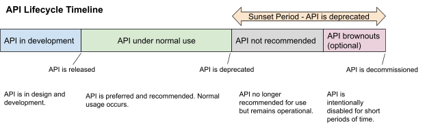

# Bandwidth API Design Standards

## Overview
Welcome to the Bandwidth API Design Requirements! This document aims to provide an easily accessible set of requirements for developers building internal and external APIs for Bandwidth. Following these requirements will allow Bandwidth to develop consistent and higher quality APIs.
These requirements are for future API development and are not intended to impact currently used APIs.

## What’s the purpose?
There is a level of comfort that comes with familiarity, that just about nothing else can beat. Humans are pattern seeking, so the best, often, most simple products, are rooted in a sense of familiarity. The nature of telecom is unfamiliar, even for developers that work closely with the concepts, so to develop a sense of familiarity in our customers, it is essential that we provide them with consistency.  

Many of our customers experience Bandwidth solely through interacting with our APIs. This means that customer experience manifests as developer experience for these users, and Bandwidth's users interact indirectly with Bandwidth's developers, through our APIs. Without regular interaction with customers, it is easily forgotten that (we/you), Bandwidth’s developers, have the most immediate and direct impact on our customer’s experience.

The quality of an API that is great on its own can be easily lost on customers if it is unlike the experience they expect from Bandwidth APIs, and that expectation cannot be met, let alone set, without consistency. Without consistency, we limit our users’ potential to develop an affinity for Bandwidth’s products, and our customers cannot fully appreciate the capabilities of our APIs when they are unpredictable.

Developer experience does not begin, or end, with the DevX team at Bandwidth. Our goal is to become internal champions who promote the truth that a company-wide, great developer experience, is the cornerstone of helping our products realize their full potential. No one can know how any user experiences our products without asking them. Regular communication with the customer and internal teams throughout discovery and implementation will help us ensure that our great ideas translate into a great developer experience.

## Model Based API Approach
Bandwidth APIs should be designed through the model based API approach. The model based API approach is centered around having CRUD operations for every endpoint, and each endpoint representing a related object in the backend.

### Why A Model Based Approach?
The alternative to a model based approach would be a functional approach, in which endpoints expose stateless operations that customers can perform. However, the model based approach makes the most sense with how Bandwidth's services work in the backend. Bandwidth doesn't offer any truly stateless services, so we'll always have a model object to track. This is especially the case with our async services like messaging. Customers may get a better understanding of how our services work if we expose our APIs as CRUD operations where customers create and manage resources that Bandwidth operates on, instead of directly performing operations.

The model based approach enforces consistency amongst our endpoints. Customers will know that every endpoint will generally have the same usage, with the only difference being what data is sent and received.

Take note that the model based approach does not discuss callbacks. Callbacks should be used for time sensitive communication. Please reference the callback section for discussion on callbacks.

### CRUD Operations

|HTTP Verb|CRUD Operation|
|--|--|
|POST|create|
|GET|retrieve|
|PUT/PATCH|update|
|DELETE|delete|

### Endpoint Formats
Retrieve, update, and delete operations should follow the `/<resource>/<identifier>` URL format, and create operations should follow the `/<resource>` URL format.

Retrieve operations shouldcan also follow the `/<resource>` URL format in order to support searching of resources.

Sub-resources should continually follow the same pattern ex: `/<resource>/<identifier>/<sub-resource>/<identifier>`

Letter case for resource names should be lower camel case, meaning the first letter is lowercase, including acronyms.

Examples:
* /resourceOne
* /resourceTwo
* /helloWorldHttp
* /httpHelloWorld
* /availableNpaNxx

### Side Effects
Operations, specifically create, may have side effects. Generally these side effects are operations Bandwidth performs in the backend.

### Request And Response Bodies
All request and response bodies on an endpoint should use the same model object. Some attributes that are set by Bandwidth, like a status attribute or unique identifier, may be omitted in the create and update request bodies.

### Model-Based Approach Rules
In order to better enforce a model based API approach, we have included some rules to follow:
1. No verbs in URL names. URL names should be exactly the resource it links to.
2. Every URL has the appropriate HTTP verbs. GET and POST should be required, but PUT and DELETE may be optional depending on the use case.
3. Request and response bodies should represent the underlying resource.
4. Resources need a unique identifier, and GET, PUT, and DELETE can use this unique identifier in their URLs. Identifiers should be treated as strings.
5. Resource names for collections must be plural.

### Model-Based API Example
In this example, we will show how a user will use a messages API designed with the model based approach. The message model will have 5 string fields (to, from, text, id, status) with id and status being set by Bandwidth.

Creating a message object will place that message in a queue, and after some time Bandwidth will deliver it. At this time, an actual text message is sent (this is the side effect of creating an object). Messages can be deleted or updated when in the queue, but not after being sent.

Request

```
POST /messages
{
    "to": "+15554443333",
    "from": "+15554442222",
    "text": "Hello from sample api!"
}
```

Response

```
201 Created
Location: https://<service-url>/messages/<id>
{
    "to": "+15554443333",
    "from": "+15554442222",
    "text": "Hello from sample api!",
    "id": "100",
    "status": "queued"
}
```

Request

```
GET /messages/100
```

Response

```
200 OK
{
    "to": "+15554443333",
    "from": "+15554442222",
    "text": "Hello from sample api!",
    "id": "100",
    "status": "queued"
}
```

Request

```
PUT /messages/100
{
    "to": "+15554443333",
    "from": "+15554442222",
    "text": "I need to send a different message!"
}
```

Response

```
204 No content
```

Request

```
DELETE /messages/100
```

Response

```
204 No content
```

### Exceptions For A Model Based Approach

File downloads should be done via a GET `/<resource>/<id>/file` request.

## Functional Based API Approach
Although the model based API approach is the preferred design, we will still include standards for building a functional based API in the event that teams need to produce functional APIs.

As a contrast to model based APIs, functional based APIs revolve around users performing operations without concern about any created resources or side effects beyond the intended operation. Generally, these operations should be stateless and synchronous, although asynchronous operations with callbacks are allowed as well.

Most of the rules for a functional based API are the same as the model based API. The exceptions are listed below

* URLs may (and generally should) have verbs in them to represent the operation performed.
* Only at least 1 HTTP method is required for each endpoint. Endpoints may have multiple HTTP methods if deemed necessary.
* Generally, you should only use GET and POST as HTTP methods.
  * GET is used to perform operations that do not require data (no request body)
  * POST is used to perform operations that do require data (has a request body)
* The lack of an underlying model on functional APIs means that request and response data may not be uniform. The API designers are responsible for making sure request and response data is sufficient to perform the operations needed.
  * Take note that requests such as data retrieval may require some underlying model. However, this model is not the cornerstone of a functional API. This is the main contrast between model and functional APIs; functional APIs may have an underlying model, but this model is not the foundation of the API.

### Functional Based API Example

In this example, we will show how a user will use a messages API designed with the functional based approach. This API will allow users to send text messages and retrieve message information. The response from sending a text message contains an identifier that can be used to retrieve message information

Request

```
POST /messages/send
{
    "to": "+15554443333",
    "from": "+15554442222",
    "text": "Hello from sample api!"
}
```

Response

```
{
    "id": "100"
}
```

Request

```
GET /messages/100
```

Response

```
{
    "to": "+15554443333",
    "from": "+15554442222",
    "text": "Hello from sample api!",
    "id": "100",
    "status": "queued"
}
```

## Breaking Changes
Breaking changes are defined as "API changes that require customers to make changes to their code". Breaking changes can range from URL updates, required parameter changes, or parameter name changes. Breaking changes to our APIs cannot be made without at least 90 days of customer notice, and should be avoided whenever possible.

Exceptions to the 90 days of customer notice are listed below. If any of these cases are true, then the breaking change can be made without prior customer notice. The breaking change should still be included in release notes.
* The API has zero usage over the previous 90 days
* The API is 100% non-functional
Take note that API breaking changes are not the same as SDK breaking changes. Although these 2 tend to correlate, SDK breaking changes may happen without API breaking changes.

> Why? Lack of communication of breaking changes leads to customer outages and a flood of customer support issues.

### Breaking Changes Examples
|Breaking Change|Reason|
|--|--|
|Adding a required field to an API request|Customers need to change their code for the API requests to include this required field|
|Renaming a field on an API request|Customers need to change their code to produce the renamed field|
|Renaming a field on an API response|Customers that use this field would need to change their code to grab the renamed field|
|Changing the side effect of an API request|This is a way to cause a breaking change without changing any API request and/or response. Customers need to update their code to make sure the API request is occurring when the expected side effect should happen. Since this is hard to conceptualize, let's use an example. Currently, Bandwidth's V2 Messaging API has a side effect when `POST /messages` is called, which sends a text message. Let's say `POST /messages` changes its side effect to only create a message object, and some other operation must occur before the text message is sent. Customers would need to update their code, because their current expectation after calling `POST /messages` is that a message will be sent, but that is no longer the case|
|Changing type of field in an API response|Unless explicitly documented, customers may make assumptions about the type of field.  For instance, the field may have a name "identifier" and return values like "4789".   An API user may assume this identifier is always going to be numeric and write code with that assumption.  A future change that converts this field value to alphanumeric may break customer code.   Similarly, even if the field is numeric, a future change that converts it from a value that can be stored in a smaller numeric value (e..g, integer) to a value that requires larger storage (e.g., long) might also break customer code.|

### What Should Not Be A Breaking Change?
|Change|Reason|
|--|--|
|Deleting a field on an API request|Bandwidth's APIs should be developed in a manner that discards extra unnecessary information on API requests. This would allow us to remove and ignore irrelevant fields on our API requests without breaking functionality|
|Adding a new optional field on an API request|By definition, a new optional field on a request should not cause any previous requests to be no longer invalid|
|Adding a new field on an API response|Users should be able to handle deserializing a response with a new field. Users will need to make code changes in order to use the new field, but that is only if users want to use the new field|

## HTTP Status Codes
HTTP status codes should follow the standard defined at https://httpstatuses.com/.

### Specific Rules For Status Codes
The following table clarifies some specific rules for Bandwidth HTTP status codes.

|Status Code|Rules|
|--|--|
|404|404s should not be returned on a search that produces no results|


### Common 4xx Error Standardization
This section shows what response body should be returned on common 4xx errors. Services should not deviate from these responses without explicit approval

#### 401
```
{
    "type": "unauthorized",
    "description": "Your request could not be authenticated",
    "suggestedFix": "Retry the request with a valid set of credentials",
    "referenceMaterial": "https://dev.bandwidth.com/guides/accountCredentials.html",
    "errorSource": "User"
}
```

#### 403
```
{
    "type": "forbidden",
    "description": "You are not permitted to access this resource",
    "suggestedFix": "Make sure your account has the proper permissions before trying again",
    "referenceMaterial": "https://dev.bandwidth.com/guides/accountCredentials.html",
    "errorSource": "User"
}
```

#### 404 (invalid URL)
```
{
    "type": "url-not-found",
    "description": "The requested URL was not found",
    "suggestedFix": "Retry the request with an existent URL",
    "referenceMaterial": "N/A",
    "errorSource": "User"
}
```

#### 404 (missing resource)
```
{
    "type": "resource-not-found",
    "description": "The requested resource was not found",
    "suggestedFix": "Retry the request with an existent resource identifier",
    "referenceMaterial": "N/A",
    "errorSource": "User"
}
```

#### 429
```
{
    "type": "rate-limit-exceeded",
    "description": "You have made too many requests on this resource",
    "suggestedFix": "Wait until your rate limit restriction expires",
    "referenceMaterial": "<link to rate limit guide for the service",
    "errorSource": "User"
}
```

If possible, include a Retry-After header on 429 errors.

### Required HTTP Status Codes

|Status Code|HTTP Method(s)|Reason|
|--|--|--|
|400|POST, PUT|All methods that have a request body should return a 400 if the request body is bad (ex: malformed, missing fields)|
|401|All|All endpoints should be protected by basic auth and return a 401 on bad credentials|
|403|All|All endpoints should return a 403 if the user does not have permissions to use the endpoint*|
|404|All|All URLs that don’t map to a valid endpoint should return a 404. Any request in the format `/resource/<id>` where the id does not map to an existing object should return a 404*|
|405|All invalid methods|All URLs that only accept a subset of HTTP methods should return a 405 on an unallowed method|


### Forbidden Resource: 403 vs 404
For the most part, a user accessing a resource guarded by permissions should receive a 403 if the user does not have the proper permissions to view/use/modify/etc the resource. However, it may be acceptable for the API to return a 404 instead for security purposes if users without permission should not have knowledge of the resource. Returning a 403 on a resource that shouldn’t be accessible to the typical user (ex: an admin URL) means that the user has found some valid URL, which could potentially be a security breach. The table below shows when to use 403 and 404 for improper permissions.

|Situation|Response Code|Reason|
|--|--|--|
|A user tries to access a protected resource without proper permissions. This resource is visible publicly on the docsite, and is clearly stated that it is only accessible to users with proper permissions.|403|The resource is known to the public for some reason, so a 403 response is valid and properly communicates the issue with the user’s request.
|A user tries to access a protected resource without proper permissions. This user should have no knowledge of this resource’s existence, and potentially should never know of this resource’s existence.|404|This resource is not known to the user (and by extension, most likely the public as well) and should remain that way. A 404 response keeps the user ignorant of this resource’s existence.|

## Base URLs
Base URLs should follow the `https://<resource_area>.bandwidth.com/api/v<major_number_version>/<path>/` format.

The resource area of the URL should be used as a high-level grouping of resources based on product or service offerings from Bandwidth. Examples include voice, messaging, dashboard, numbers, billing, and webrtc.

The version of the URL should be used to signal breaking changes on the API. It does not need to be tied to product versions, although that is possible.

> Why? Following a standard leads to uniformity across all products.

## Datetime Objects
Datetime objects should use the RFC 3339 format (example: 2017-07-21T17:32:28Z).

> Why? This is the format recommended by Swagger.

## Bandwidth Specific Data Formatting Guidelines
In order to maintain consistency on our APIs, we have some required formats for data types that may exist within multiple Bandwidth services.

|Data Type|Required Format|Example|References|
|--|--|--|--|
|Phone Numbers|E.164|+15554443333|NA|

> Why? Users should not need to reformat data types across different API calls.

## JSON
JSON is the preferred format for API requests and responses for Bandwidth’s APIs.

> Why? JSON is heavily supported across many programming languages, and has many features that make API design most consistent when compared to other data formats. Customers tend to prefer JSON as well.

## XML
XML should not be used for Bandwidth's APIs, unless XML provides something that other data formats like JSON doesn't.

Although XML is not allowed based on this requirement, XML API requirements are included to cover cases where XML needs to be used.

> Why? XML is objectively harder to use than JSON and should only be used if JSON is unavailable.

### XML Issues
* XML arrays of size 1 are indistinguishable from a non-array
* XML loses some primitive typing by treating booleans and numeric values as strings

### XML Arrays
XML arrays should always have a wrapper tag that is identified by the item it is wrapping plus List, along with a type=”array” attribute. Pluralization of the item to represent an array is not allowed in this requirement. Wrapper tags should not include anything other than the array items.

Empty lists should always be included in the response body, assuming that a list is always returned.

#### Good examples
```
<Object>
    <ValueList type=”array”>
        <Value>a</Value>
        <Value>b</Value>
    </ValueList>
</Object>

<Object>
    <ValueList type=array/>
</Object>
```

#### Bad examples

No wrapper tag:
```
<Object>
    <Value>a</Value>
    <Value>b</Value>
</Object>
```

Bad list name:
```
<Object>
    <Values type=”array”>
        <Value>a</Value>
        <Value>b</Value>
    </Values>
</Object>
```

Non list items in the list:
```
<Object>
    <ValueList type=”array”>
        <Value>a</Value>
        <Value>b</Value>
        <Description>Char value</Description>
    </ValueList>
</Object>
```
Missing type=array attribute:

```
<Object>
    <ValueList>
        <Value>a</Value>
        <Value>b</Value>
    </ValueList>
</Object>
```

Missing empty list object:

```
<Object>
</Object>
```

> Why? The wrapper tag explicitly shows where an array is, and removes ambiguity when the array only has 1 item.

## Overloaded Endpoints (a single endpoint with multiple operation possibilities)
Endpoints should not be overloaded with functionality configured by the request body, but can be overloaded in terms of data retrieval.

Good example:

```
POST /communicate/text
    {
        "to": "+1555",
        "from": +1666",
        "text" "hi"
    }

POST /communicate/voice
    {
        "to": "+1555",
        "from": "+1666",
        "voice": "hi"
    }
```

Bad example:

```
POST /communicate
    {
        "to": "+1555",
        "from": "+1666",
        "operation": "text",
        "text": "hi"
    }

POST /communicate
    {
        "to": "+1555",
        "from": "+1666",
        "operation": "voice",
        "voice": "hi"
    }
```

> Why? It's easier for users to get an understanding of API functionality with single operational endpoints, and reduces the complexity of JSON request bodies. It also makes the functionality easily visible in autogenerated SDKs.

## Idempotency and Safety in RESTful API’s
An idempotent operation is one that returns the same result no matter how many times it is called. In arithmetic, x+0 would be considered an idempotent operation, because it could be repeated an infinite number of times and return the same result, x, each time.

A safe method is one that does not alter the state of the resource when it is called. A safe method is one that can be thought of as ‘read-only.’ Safety is not determined by the method but the server, meaning that a GET request could trigger a function on the server to modify the resource, which would not be allowed by these guidelines.

APIs should follow standard idempotency and safety guidelines to maintain consistency across all APIs.

|HTTP METHOD|IDEMPOTENT|SAFE|
|--|--|--|
|GET|YES|YES|
|POST|NO|NO|
|PUT|YES|NO|
|PATCH|NO|NO|
|DELETE|YES|NO|

### GET
The GET method is considered both idempotent and safe. A GET request should never update the state of the resource. If nothing has modified that resource in the meantime, a GET request should always return the same information.

### POST
The POST method is neither idempotent nor safe. A POST request will create a new resource with each request, resulting in new resources stored on the server or new messages sent to users.

### PUT
The PUT method is idempotent, but unsafe. A PUT request to a resource should replace the entire resource with each request. Two or more identical subsequent PUT requests to the same resource will result in a modification of the resource on the first request and leave it unchanged, unless the request body is modified.

In certain cases, the PUT method can be used to create a new, named resource. Ex. a PUT to `/resource/<id>` where `<id>` does not yet exist would create a new resource, identifiable by the `<id>` value in the URL string. If the PUT were to be made using an existing `<id>`, idempotency rules would apply and the existing resource would be replaced by the new request.

It is important to note that if the entire resource can not be modified, a PATCH method should be used.

### PATCH
The PATCH method is neither idempotent nor safe. PATCH is capable of modifying a part or an entire resource. In some cases, the PATCH method could be considered idempotent. For example, consider a resource with the property `name`. A PATCH request with a payload of `{"name": "foo"}` could be repeated multiple times and produce the same result. Like PUT, it would modify the resource after the first call but return an unchanged resource with each subsequent call, which is typical of idempotent behavior.

However, PATCH is generally considered non-idempotent because there are operations that could be performed once but would fail after subsequent calls. Consider a PATCH request with a payload of `{"op": "move", "from": "/a/b/c", "path": "/a/b/d" }`. The first request would modify the resource, and any subsequent identical requests would fail because the resource no longer exists at path `a/b/c`.

### DELETE
The DELETE method is considered idempotent but unsafe because it removes the resource entirely. It is important to note that multiple DELETE requests should result in 404 errors after the first request because the resource no longer exists. DELETE could be considered an exception to the rule, but is accepted as idempotent because the deletion of the resource is considered the change in value, which would be the same each time if the resource continued to persist on the server.

## "string" vs "integer" in OpenAPI specs
The rule of thumb for using "integer" in OpenAPI specs is "If it makes sense to add 1 to it, use integer" even if the value will only be numbers, or if there is a purpose in comparing them numerically. Bandwidth APIs should follow this rule.

For example, HTTP status codes have a numeric check for success (2XX), redirect (3XX), client error (4XX), and server error (5XX).

> Why? If the value is not being used for arithmetic purposes, there is no guarantee that it will always remain as a number. Integer to string conversion is more guaranteed than string to integer conversion.

### "string" Examples
* IDs
* Telephone numbers

## API Fragment Reuse
An API fragment is a piece of an API that could be in the request, in the response, or in both. It can be easily conceptualized if an API is thought of in the structure of an OpenAPI specification. The API fragment would then be a section from the OpenAPI. API Fragments should be reused across endpoints when necessary.

> Why? The reuse of the fragment will save development time for both Bandwidth and its customers. It will also provide homogeneity.

## Field Names Across Multiple Endpoints
If your API has multiple endpoints that use common features, the field names for these common features should be shared. As an example for Bandwidth, we use phone numbers for many of our operations. Mixing `phoneNumber`, `number`, `telephoneNumber`, and `telePhoneNumber` is not allowed in this standard.

In addition to field names, values included in the request and response bodies should follow the same format across the API. A few examples would be dates and phone numbers. Refer to other sections in this guide for standards to follow regarding value formats.

> Why? Domain specific knowledge of our API fields is transferable between endpoints

## Endpoint/Method/Status Code And Response Body Mappings
The response body's underlying model object should have a 1 to 1 mapping with the endpoint's status codes. If you find yourself needing multiple response bodies on a given endpoint, you may need to implement multiple status codes (for example, error response bodies are different than success response bodies) or break out your functionality into multiple endpoints.

> Why? Having a single expected response body on a given response code makes deserialization of responses deterministic

## JSON Object Field Names
JSON object field names should be camel cased with the first letter lower cased.

Example:
```
{
    "variableOne": "value",
    "variableTwo": "value"
}
```

> Why? This is what Bandwidth wants for the standard for JSON objects

## XML Object Field Names
XML object field names should be Pascal casecamel cased with the first letter upper cased.

Example:
```
<Response>
    <VariableOne>value</VariableOne>
    <VariableTwo>value</VariableTwo>
</Response>
```

> Why? This is what Bandwidth wants for the standard for XML objects

## Errors
4XX and 5XX HTTP responses should include the following fields

|Field|Description|
|--|--|
|type|Unique identifier for an error|
|description|Human readable description of the error|
|suggestedFix|A potential fix that the user can do to resolve the error|
|referenceMaterial|A link to a page that the user can use as reference to avoid the error|
|errorSource|One of Bandwidth, User, or Industry that states the reason for the error|

Additional fields may be added to errors as needed.

Unique identifiers should map to the type of error encountered, even if the same error may occur in multiple locations.

In OpenAPI/Swagger specs, each expected 4XX and 5XX response needs to be explicitly declared, even if the response body is always the same.

Example:
```
{
    "type": "error-type",
    "description": "Human readable description of the error",
    "suggestedFix": "Retry the request with all phone numbers in E164 format",
    "referenceMaterial": "https://dev.bandwidth.com/messaging/methods/messages/createMessage.html",
    "errorSource": "User"
}
```

> Why? Normalized error responses across our APIs make them easier to consume, and types allow easier internationalization for users of our APIs.

### Error Order For Multiple Errors In A Single Request
It’s possible for users to make multiple mistakes on 1 API request. For example, a user can send bad credentials and an invalid request body at the same time. However, REST APIs can only return 1 error at a time. This section covers the order of errors to return when there are multiple user errors. Overall, the errors should go from more general to more specific, and cheap to check to expensive to check. This section will only cover user errors (4xx), since server errors (5xx) are out of the user’s control and should always be the first thing returned no matter what.

The order for the most common errors is as follows:
404 > 401 > 403 > 400 >= 429

#### Why This Order?
404: When the user makes a request on an invalid URL, the API should immediately respond with a 404 without any awareness of auth, request body, permissions, or rate limits. This is due to not knowing the correct destination of the request, so any other response would be a guess on what the correct API endpoint should have been, and not a factual response based on the user’s invalid request.

URL validation should be implemented trivially and be a very cheap operation, making it an easy first thing to catch.

401: Credentials should be the first thing checked when a user makes a request on a valid URL. This uniformity will lead to immediate knowledge of invalid credentials, which is relevant for all API endpoints.

Credential validation should also be a cheap operation, making it an easy next thing to catch.

403: This is similar to 401, but permissions should be the next thing checked once the user’s credentials are validated. A 403 cannot be thrown before a 401 because credentials may be tied to permissions, and invalid credentials by definition will not have permissions.

Permission validation should also be a cheap operation, making it an easy next thing to catch.

400: After the user’s credentials and permissions are validated on an endpoint, then the request contents should be validated.

Request validation may or may not be a cheap operation, so it’s best to do this after the user’s credentials and permissions are validated.

429: Due to their dynamic nature, rate limit errors should almost always be the last error that the user can receive. This is especially true for rate limiting that is done only via backend queueing (so there’s no hard limit on API requests over a given time period), which is how most of Bandwidth’s APIs are rate limited. This is due to the fact that successful requests are the only requests that can contribute to the queue, so an invalid request could never trigger a rate limit breach.

The only exception to this rule could be for endpoints that fit both of these criteria: the endpoint is rate limited via a hard count over a time period, and request validation on the endpoint is an expensive operation. In this situation, a 429 being returned on an invalid request before request validation is perfectly reasonable. This is feasible due to the fact that authentication and authorization have already passed, so the expensive request validation can still be counted to the user’s rate limit even if the request is invalid. Placing the cheap rate limit validation before the expensive request validation also serves the purpose of rate limits.

Rate limit validation should always be a cheap operation. An expensive rate limit validation defeats the purpose of rate limiting.

## Nested Resources
The pattern of `/resource1/<identifier>/resource2/<identifier>` should be used if and only if the existence of `resource2` instances is dependent on the existence of an instance of `resource1`. If this is not the case, `resource2` should exist as its own path, and any relationship between `resource1` and `resource2` should be identified by proper attributes on those resources.

For this example, let's assume we have an apartment complex that contains `units` and `tenants`

Example of endpoints where the decision was made such that `tenants` must exist with `units`:

```
GET /units/f-123

GET /units/f-123/tenants/john
```

Example of endpoints where the decision was made such that `tenants` can exist without any `units`:

```
GET /units/f-123

GET /tenants/john
```

> Why? The existence of nested resources implies a required relationship

## Non-nested Object Relationships
For object relationships that are not nested, the following rules should be used to represent the relationships in the API schema. All object relationships should have bidirectional representation. Note the emphasis on API schema; the backend implementations may differ.

* 1-1: Each object has an identifier to the other object
* 1-N: The “N” objects each have an identifier to the “1” object, and the “1” object should have a list of identifiers for the “N” objects
* N-M: Each object has a list of identifiers to the other objects

## Batch Requests
Some API endpoints that perform bulk operations may have the possibility for a partial failure. An example of this would be ordering multiple phone numbers, since it's possible for some to be ordered successfully, and some to not be.

### Partial Failure
In the event of a partial failure, the API should return an appropriate 2XX response to represent the successful operations, the appropriate response body, and include an `errors` section in the response body. The `errors` section will be a list of error objects defined in the errors section of these requirements, and some type of identifier that allows the user to see what part of the API request failed. Using the phone number ordering example, `telephoneNumber` would be an appropriate identifier. The successful pieces of the API request do not need to be included in the response body. Including them is optional based on the usage of the endpoint.

### Complete Failure
In the event of a failure on every single piece of the request, the API should return an appropriate 4XX/5XX response, and the response body should only contain the `errors` section.

### Complete Success
In the event of a success on every single piece of the request, the API should return an appropriate 2XX response, and the response body should not contain the errors section.

### Batch Example
Request

```
POST /telephoneNumbersOrder

{
    "telephoneNumbers": [
        "+1555444333",
        "+15556667777",
        "+15553331111"
    ]
}
```

Response (partial failure):

```
HTTP 200
{
    <appropriate response body>
    "errors": [
        {
            "type": "number-malformed",
            "description": "Number is not E164 format",
            "suggestedFix": "Make sure your number is in E164 format",
            "referenceMaterial": "https://dev.bandwidth.com/numbers/apiReference.html",
            "errorSource": "User",
            "telephoneNumber": "+1555444333"
        },
        {
            "type": "number-unavailable",
            "description": "Number is not available to order",
            "suggestedFix": "Request a different number to order",
            "referenceMaterial": "https://dev.bandwidth.com/numbers/apiReference.html",
            "errorSource": "User",
            "telephoneNumber": "+15556667777"
        }
    ]
}
```

Response (complete failure):
```
HTTP 400
{
    "errors": [
        {
            "type": "number-malformed",
            "description": "Number is not E164 format",
            "suggestedFix": "Make sure your number is in E164 format",
            "referenceMaterial": "https://dev.bandwidth.com/numbers/apiReference.html",
            "errorSource": "User",
            "telephoneNumber": "+1555444333"
        },
        {
            "type": "number-unavailable",
            "description": "Number is not available to order",
            "suggestedFix": "Request a different number to order",
            "referenceMaterial": "https://dev.bandwidth.com/numbers/apiReference.html",
            "errorSource": "User",
            "telephoneNumber": "+15556667777"
        },
        {
            "type": "number-unavailable",
            "description": "Number is not available to order",
            "suggestedFix": "Request a different number to order",
            "referenceMaterial": "https://dev.bandwidth.com/numbers/apiReference.html",
            "errorSource": "User",
            "telephoneNumber": "+15553331111"
        }
    ]
}
```

Response (complete success):

```
HTTP 200

{
    <appropriate response body>
}
```

> Why? HTTP doesn't have a standard to represent a partial failure. The most accepted practice for partial failures is to treat it as a successful response, but include information on what parts didn't go well. The `errors` section is a normalization of how Bandwidth currently handles partial failures.

## GET vs POST vs PATCH vs PUT vs DELETE
This section defines how Bandwidth's APIs should use HTTP verbs.

* GET: Retrieval of a resource or multiple resources. Does not take a request body, but may use query parameters for retrieval requirements.
* POST: Creation of a resource. The resource identifier should be included in the response body under an id field.
* PATCH: Updating some attributes of an already existing resource.
* PUT: Updating all of the attributes of an already existing resource (complete replacement).
  * If a resource element is missing from a PUT request, that element should revert to a reasonable, default value, which may include being removed from the resource entirely if the element is not required.
  * If a required resource element is missing from a PUT request, the API should return an appropriate 4xx error.
* PUT can also be used for resource creation in situations where the user can control the resource ID. In this event, PUT `/resource/<id>` will create a resource.
* DELETE: Complete removal of a resource. Does not take a request body.

> Why? These are HTTP standards

## Pagination
Pagination is a hard thing to standardize since there are many ways to do pagination, and pagination methods may be different depending on different situations. At the end of the day, the pagination method should be chosen based on the use case.

This section outlines some ways that Bandwidth’s APIs have done pagination, and suggestions on when you should use these methods of pagination.

### Pagination via previous and next tokens
This method of pagination requires the API response to include 2 tokens. One token represents going to the “next” page, and the other token represents going to the “previous” page. One of these tokens should be included in subsequent requests. These requests should match the original request excluding the additional token. The API should have 2 parameters that accept the “previous” and “next” tokens respectively. When there are no more items on the subsequent “next” or “previous” page, those tokens should be excluded from the response.

When to use: When you have ordered data that requires bidirectional traversal.

Pros: Provides bidirectional pagination with implementation hidden from the user.

Cons: A bit clunky to use on endpoints that are customizable beyond the tokens (ex: query parameters for date ranges) due to having to construct the same API request. It would be great if the API could work with just the pagination tokens without needing to reconstruct the same API request.

Example:

```
GET /messages?startDate=2016-09-14T18:20:16.000Z

Link: </messages?startDate=2016-09-14T18:20:16.000Z&token=qwer1234>; rel=”next”
Link: </messages?startDate=2016-09-14T18:20:16.000Z&token=4321rewq>; rel=”previous”

{
    “messages”: [
        <message info>
    ],
    “pagination”: {
         “nextToken”: “qwer1234”,
         “previousToken”: “4321rewq”
    }
}
```

Next requests

```
GET /messages?startDate=2016-09-14T18:20:16.000Z&nextToken=qwer1234
GET /messages?startDate=2016-09-14T18:20:16.000Z&prevToken=4321rewq
```

Response with no previous pagination

```
GET /messages?startDate=2016-09-14T18:20:16.000Z

Link: </messages?startDate=2016-09-14T18:20:16.000Z&token=qwer1234>; rel=”next”
{
    “messages”: [
        <message info>
    ],
    “pagination”: {
         “nextToken”: “qwer1234”
    }
}
```

Response with no pagination

```
GET /messages?startDate=2016-09-14T18:20:16.000Z

{
    “messages”: [
        <message info>
    ]
}
```

### Pagination via continuation tokens
This method of pagination requires the API response to include 1 token that is used to go to the next page in subsequent requests. The subsequent requests should match the original request ,with the token included. The API should have 1 parameter that accepts the continuation token. When there are no more items on the page, the token should be excluded from the response.

When to use: When you have ordered data that should only be traversed in 1 direction.

Pros: Provides pagination with implementation hidden from the user. Having only 1 token simplifies usage and reduces the possibility of user error

Cons: A bit clunky to use on endpoints that are customizable beyond the tokens (ex: query parameters for date ranges) due to having to construct the same API request. It would be great if the API could work with just the pagination tokens without needing to reconstruct the same API request. Only provides pagination in 1 direction.

Example:

```
GET /messages?startDate=2016-09-14T18:20:16.000Z

{
    “messages”: [
        <message info>
    ],
    “pagination”: {
         “continuationToken”: “qwer1234”
    }
}
```

Next API request

```
GET /messages?startDate=2016-09-14T18:20:16.000Z&continuationToken=qwer1234
```

Response with no pagination
```
GET /messages?startDate=2016-09-14T18:20:16.000Z

{
    “messages”: [
        <message info>
    ]
}
```

### Pagination via page parameter
This method of pagination requires the user to include a numeric parameter that represents what section (page) of the data the user wants to grab. This gives the user complete control over pagination. Pages should be 0 based, and if a page parameter is not included the API should default to page 0. Pages that are out of range should return a 204 no content response.

When to use: When you have ordered data that doesn’t change in real time, and also may require users to start a search at a different location than the start.

Pros: Complete control is given to the user with high flexibility.

Cons: Data that changes in real time will not work nicely with this pagination method, since subsequent requests aren’t knowledgeable of previous requests. The lack of some token controlled by the backend API means that the users must be aware of how the data is changing in real time. The users need more knowledge of how this method of pagination works.

This method of pagination is not recommended for the majority of Bandwidth’s APIs. Please only use this method of pagination deliberately and understand the consequences of using it.

Example:

```
GET /messages?startDate=2016-09-14T18:20:16.000Z

{
    “messages”: [
        <message info>
    ]
}
```

Next API request

```
GET /messages?startDate=2016-09-14T18:20:16.000Z&page=1
```

Response with no data

```
GET /messages?startDate=2016-09-14T18:20:16.000Z&page=10000

204 no content
```

## Cancelling An Operation
DELETE should not be used as the means to cancel an operation. Instead, PUT should be used to update the operation’s state to represent some type of cancelled state.

## Async APIs
Many of Bandwidth’s services operate on an asynchronous model. This means that the outcomes of requests (side effects) may not occur at the same time that the request is created. Since async APIs involve more than just calls and responses, this section will cover how these operations should be handled.

### Requests and responses
Create requests on asynchronous APIs should be identical to those on synchronous APIs, with the only exception being an addition of an identifier for a callback destination. Although callbacks are not required for async APIs, Bandwidth’s async APIs must be callback driven.

Create responses on asynchronous APIs should be identical to those on synchronous APIs, in the sense that the responses are the created model objects. Unassigned fields that may be populated in the future should have a default value, and not be left blank.

### Callbacks
In the context of async HTTP APIs, callbacks are HTTP requests that the API sends to the user. The user needs to have a server that can accept these HTTP requests.

#### When to send callbacks
Callbacks should be sent any time the async API performs an operation that the user needs to be aware of.

#### Defining callback destinations
Callback destinations must always be user defined, and must always be URLs accessible by Bandwidth’s APIs. These are called the callback URL. There are 3 methods for users to define callback URLs.

* Method 1: The callback URL is an attribute on the created resource, and all callback events on this resource are sent to the URL
* Method 2: The callback URL is pre-configured within the user’s account, and some identifier for this configuration is an attribute on the created resource, and all callback events on this resource are sent to the URL linked to the identifier
* Method 3: The callback URL is pre-configured within the user’s account, and all callback events are implied to go to this URL

Method 1 is the most preferred method, followed by method 2, and method 3 is the least preferred method

#### Callback object
The callback object should include the following fields
|Field Name|Field Description|
|--|--|
|type|A unique identifier for what initiated the callback|
|description|A human readable description of what initiated the callback|
|`<object>`|The named object affected by the callback event. This can be any reasonable value to identify the object|

Example for a callback for a message delivery:

```
{
	“type”: “message-delivered”,
	“description”: “Your message has been delivered”
	“message”: {
		“to”: “+15554443333”,
		“from”: “+15554442222”,
		“id”: “12345”
	}
}
```

### Callback method
Callbacks should be sent as POST requests.

### Callback security
Customers may protect their URLs with basic auth username and password, following the protocol defined at https://tools.ietf.org/html/rfc7235.

Basic auth credentials may be included in the request body along with the callback URL, and can also be defined in the user’s account pre-configuration.

### Callbacks for events not initiated by the user
Callbacks for events not initiated by the user should operate identically to callbacks for events initiated by the user. Users must be able to configure their account to set callback URLs for these events. Every unique callback event must have the option to be sent to a different URL.

### Callback retries
In the event that a callback is sent to a user and results in a non-200 response from the users server, the callback should be periodically retried to ensure delivery. Callback retires should be structured in a way that reduces performance load on the service, but allows the user time to recognize and repair any server issues. A 24 hour exponential backoff and retry is preferred.

Not Implementing callback retries pushes users to rely on client-side polling. Adding retries to our callbacks allows users to depend on receiving these notifications through deployments and network delays.

### Client-Side Polling
Polling is not a preferred method of handling asynchronous events. Polling requires extra API requests placed on our servers, requires customers to handle state, and is not practical for operations that need extreme time precision. However, we understand that there are use cases in which polling is preferred, or even required. This section outlines how to handle asynchronous events via polling.

Each object will have an appropriate field to represent its state, ideally named `state`. This field will be an enum of reasonable values that are both human and machine readable, and will be used by consumers programmatically to know when asynchronous events are complete.

There will be no new API endpoints to handle asynchronous management; only the GET resource will be necessary. The response body will update as the object in question changes asynchronously.

Objects are created and maintained through standard REST endpoints.

Pseudo code example with a resource with 2 states (`queued`, `complete`)

```
resource_id = create_resource(“1 2 3 4 5”)

do
   sleep(1)
   response = get_resource(resource_id)
while (response.state != complete) //alternative: while (response.state == queued)

print(resource_id + “ is complete”)
```

## API Lifecycle Management
APIs constantly evolve and require lifecycle management. There are two key concepts to manage this.

* Deprecation - This means the API is no longer recommended for use but is still operational. Customers can still use it but they should migrate to usage of the latest API.
* Sunsetting - This means the API will be decommissioned at an announced time and will no longer be available for use after that point in time. APIs that are end-of-life will not have a replacement when sunset ends. APIs that are not end-of-life require a new version when sunset begins.

The phases of API lifecycle management are illustrated in the timeline.



### Guidelines on When to Deprecate an Endpoint
Throughout the lifecycle of an API, all efforts should be made to not introduce breaking changes. When it is necessary to introduce breaking changes, then endpoint(s) should be sunsetted to coincide with a new version being released. This allows clients time to transition to the new version as both new and old are available during the Sunset Period. The other scenario to sunset an endpoint is when there is no replacement but it is still desirable to decommission due to an end-of-life of the resource or area of the product.

### Sunset Period and Communicating Endpoint Deprecation
The sunset period for an endpoint or multiple endpoints is to be determined by each product team. Each product has API consumers with differing needs and it is not appropriate to mandate a fixed sunset length across all Bandwidth products as expected timelines may vary widely.

Product teams MUST contact the Service Experience team for discussions about their Customer Activation Plan prior to beginning the deprecation of an API endpoint. This is the primary method to communicate API changes to customers.

Product teams, working with the Service Experience team, should make an announcement at least 90 days prior to the planned deprecation date. The Service Experience team has communication methods and procedures to handle notifications. Notifications are done via Zendesk tickets and follow-up posts on a 30-90 day timeline for decommissioning.

### Sunset RFC 8594
The specification in Sunset RFC 8594 should be followed during the sunset period of APIs

* The [Sunset HTTP Header Field RFC 8594](https://tools.ietf.org/html/rfc8594) documents the Sunset response header field and its usage
* The header is a single timestamp that advertises a specific point in time where the resource will become unresponsive
* All API endpoints that have been deprecated must respond with the Sunset header field
* It is not appropriate to use the Sunset header prior to deprecation as the API is still the recommended API
* It is not appropriate to ONLY use the Sunset header to announce deprecation. Product teams must make an announcement to customers via the Service Experience team.

## Versioning
As stated in the base URLs section of these standards, all URLs should follow a `https://<product>.bandwidth.com/api/v<number>/<path>/` format. The `<number>` value should be a single number representing the major version of the API (ex: 1, 2, etc). Minor and patch versions of the API are not allowed in the URL, and other versioning schemas like date-time objects are also not allowed in the URL.

A version number must be incremented when a breaking change has been made. Non-breaking changes do not result in an increment of the version number.

Deprecation of API versions should be considered a breaking change, and should follow the same standards for other breaking changes. API lifecycle management is driven through versioning and deprecation. Refer to the API Lifecycle Management section for the approach and phases of API lifecycle management.  

### Versioning Of APIs vs SDKs
Bandwidth’s SDKs and APIs are versioned independently, but may have some correlation.

Typically, minor updates on APIs will also lead to minor updates on the SDKs. This is due to the new feature(s) on the APIs simultaneously being added to the SDKs.

Typically, SDKs will have more major updates and patch updates than APIs. This is due to SDK improvements that are made independently of API changes. These SDK improvements may range from package dependency updates to improved (and possibly changed) interfaces.

Major updates on APIs may or may not result in major updates on the SDKs, depending on the scope of the change. Some breaking changes on the API, such as URL changes and enum value changes, may be hidden by patch updates to the SDKs, while others, such as interface changes, cannot be hidden by the SDKs and will require major updates to the SDKs. Some API changes such as data format changes and credential updates may not even require SDK changes at all.

## Optional Values And Null Values
API responses should always contain every single field defined by the underlying model. Fields may not be omitted in the response. Optional fields, or fields that may not currently be defined, should be returned with `null` values.

API requests may be defined with `null` values, or those fields may be omitted. The API should treat omitted and `null` values identically.

The OpenAPI spec that defines these APIs should use the `nullable: true` definition for any optional field.
